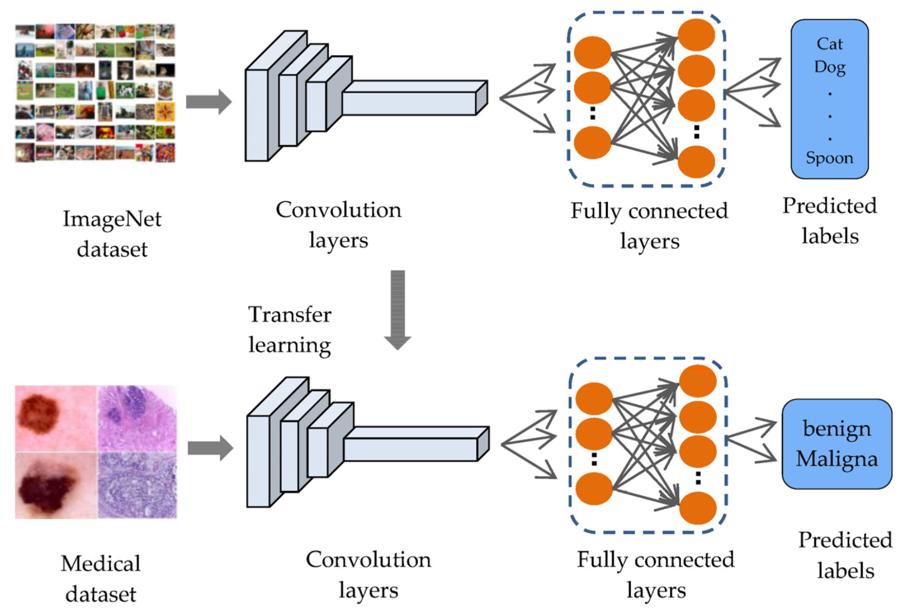
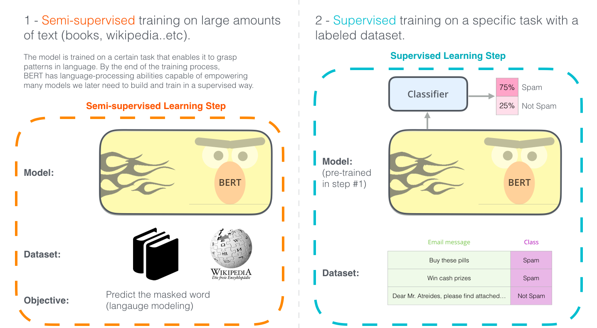
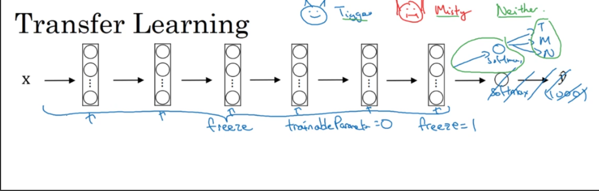

# Pre-training-and-Fine-Tuning-with-PyTorch

**Transfer learning** is a powerful technique in machine learning where we apply knowledge gained from solving one problem to a different but related problem. Imagine it like this: rather than starting from scratch every time, we use the insights and lessons learned from a model that was trained on a large and comprehensive dataset, and apply them to our specific task. For instance, we could take a model that has been trained to recognize a myriad of objects in millions of images, such as those from the ImageNet dataset, and use that knowledge to boost our own image-related project. Similarly, in the world of text and language, a model that has been fed vast amounts of text to understand and interpret language can be repurposed to help classify different text samples in our own work. This approach is like standing on the shoulders of giants – we leverage the hard work and learning a model has already done, and use it to give our project a head start. The key idea is to find a model that excels in a certain area and adapt its strengths to our unique challenges, thereby enhancing the performance and efficiency of our own model.



**Pre-Trained Models** are a direct outcome of transfer learning. These models are trained on large benchmark datasets and tasks, and then made available for others to use. These models have already learned a large set of features, which can be a very effective starting point for training a model on a new task.
For instance, in computer vision, models like VGG, ResNet, and Inception are trained on the ImageNet dataset, which contains millions of labelled images in thousands of categories. In natural language processing, models like BERT, GPT, and T5 are trained on extensive text corpora and can be used for tasks like language translation, question-answering, and text generation.
Using pre-trained models can significantly reduce the time, computational cost, and the amount of data required to train an effective model. They provide a major advantage in that they reduce the need for a large amount of computational resources and expertise to train a model from scratch.

**Fine-Tuning** is a process that tweaks a pre-trained model to adapt it more closely to the specific characteristics of the task at hand. It involves continuing the training of the model on a new task, using a smaller dataset specific to that task.

During fine-tuning, the pre-trained model is adjusted in such a way that the model's weights are 'fine-tuned' to the new task. This usually involves a few steps: initially, the model's existing weights are frozen, and only the last few layers are trained on the new data. Once these layers have been sufficiently trained, the earlier layers can be unfrozen and the entire model can be trained (to a smaller extent) on the new data.
Fine-tuning allows the model to transfer the knowledge it has learned from the previous task (like recognizing shapes or understanding language structure) to the new task. This results in a much more efficient training process than training a model from scratch, as the model already has a good understanding of the general features and only needs to adjust its understanding to the specifics of the new task.



# Why we use transfer learning 

If we are building a computer vision application rather than training the weights from scratch, from random initialization we often make much faster progress if we download weights that someone else already trained on the network architecture and use that as a pre-trained and transfer that to a new task that we might be interested in. The ComputerVision Research community has been pretty good at posting lots of datasets on the internet like for example :- ImageNet, MsCOCO.

Sometimes training takes several weeks and might take many many GPU's and the fact that someone else's done this and gone through the pain of hyper parameter searching process, means we can often download open source weights that took someone else many weeks or month to figure out and use that as a very good initialization for our neural network and use transfer learning to shift that knowledge in to our mini-problem. 

Let's see one Motivating Example :- Let's say we are building a cat detector to recognize our own pet cat called tiger, misty and neither. So we have a classification problem with three classes and we probably don't have a lot of pictures of tiger and misty. So our training set will be small. So what can we do ? We can go online and download some open source implementation and not just the code but also the weights and there are a lot of neural networks that are trained with datasets like ImageNet. The Network trained by ImageNet dataset has an output class of 1000 with a softmax unit. What we can do is get rid of the softmax layer and create our own softmax unit that outputs tiger, misty and neither. And  in terms of the network it's better to think all of these layers are frozen, so freeze the parameters in all of this layer of the network and we would just train the parameters associated with our softmax layer.



And by using someone else's pre-trained weights we might be able to get pretty good performance even on a small dataset. A lot of deep learning frameworks support this mode operation and depending on the framework it might have things like trainable parameters = 0 to set that for those earlier layers in order to say, don't train those earlier layers,  or sometimes we have a parameter freeze = 1, so these are our parameters that let's us whether or not to train the weights associated with a particular layer.
One rule of thumb is if we have a larger label data set so maybe we just have a ton of pictures of Tigger, Misty as well as pictures of neither, one thing we could do is then freeze fewer layers. Maybe we freeze just the top layers and then train the later layers. Although if the output layer has different classes then we need to have our own output unit, which is Tigger, Misty or neither. There are a couple of ways to do this. 

* We could take the last few layers and just use that as initialization and do gradient descent from there

* we can also blow away these last few layers and just use our own new hidden units and our own final softmax outputs. 

* Another pattern is if we have more data, the number of layers we’ve frozen could be smaller and then the number of layers we train on top could be greater. The idea is that if we pick a data set and maybe have enough data not just to train a single softmax unit but to train some other size neural network that comprises the last few layers of this final network that we end up using.


Finally, if we have a lot of data, one thing we might do is take this open source network and use the whole thing just as initialization and train the whole network. Although if this was a thousand of softmax and we have just three outputs, we need our own softmax output. The output of labels we care about. But the more label data we have for your task or the more pictures we have of Tigger, Misty and neither, the more layers we could train and in the extreme case, we could use the ways we download just as initialization, so they would replace random initialization and then could do gradient descent, training updating all the ways and all the layers of the network. That's transfer learning for the training of ConvNets.

# Implementation of Transfer Learning 

## Getting a pre-trained model 

The whole idea of transfer learning is to take an already well-performing model on a problem space similar to ours then customizing it to our case. When we are working on computer vision and NLP problems, we can find pre-trained classification models in torchvision.models and torchtext.models.
 
```
import torch
from torchtext import models
dir(models)

 'FLAN_T5_BASE',
 'FLAN_T5_BASE_ENCODER',
 'ROBERTA_BASE_ENCODER',
 'T5Transform',
 'T5_LARGE',
 'T5_LARGE_ENCODER',
 'T5_LARGE_GENERATION',
 'XLMR_BASE_ENCODER',
 'XLMR_LARGE_ENCODER',


```
import torch
from torchvision import models
dir(models)

 'AlexNet',
 'AlexNet_Weights',
 'ConvNeXt',
 'VGG'
 'VGG16_Weights',
 'alexnet',
 'convnext',
 'resnet101',
 'resnet152',
 'resnext101_32x8d'
 'segmentation',
 'shufflenet_v2_x0_5',
 'vgg16',
 'vit_b_32'